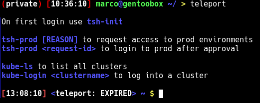
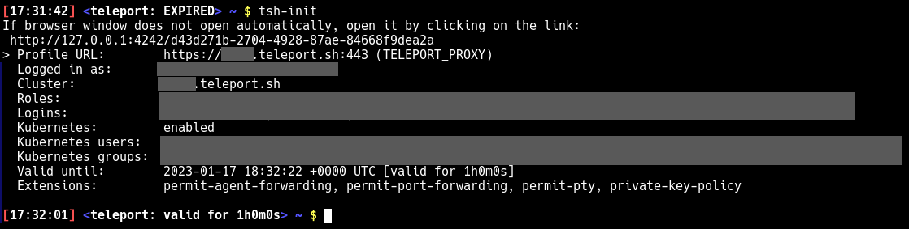
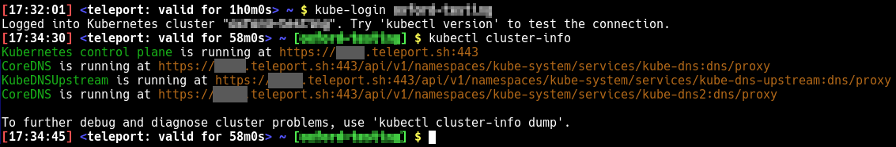
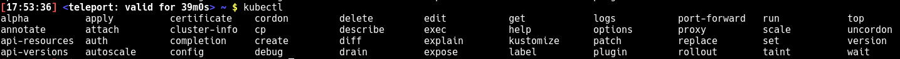
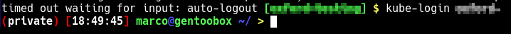

# Teleport in docker

This is a docker container that contains teleport and kubectl plus some QoL improvements
to provide a separated environment when accessing remote clusters via teleport.



There is no dependencies needed on your local machine besides docker.

The teleport session will reside outside the container in `${HOME}/.tsh` ready for reuse, while the critical
kube context is inside your container.

No accidential mix up of local dev environmnet with production systems possible :)

## build

### For x86_64 systems

```bash
$ docker build -t teleport .
```

### For ARM systems

(currently untested due to the lack of an arm system)

```bash
$ docker build -t teleport --build-arg CLOUDCLI_ARCH=arm .
```

## Run

Add the following settings to your bashrc or export them in any other way in your shell.

__*Adjust the valuies correspondingly*__

```bash
export TELEPORT_PROXY="xxxx.teleport.sh:443"
export PROD_ROLES="xxxx-production-user"
```

You can start the container by running

```bash
./teleport
```

## Screenshots

### wrapper scripts




### shell prompt



The prompt will show the kube context in different colors based on environment:
<span style="color:green">testing</span> <span style="color:yellow">staging</span> <span style="color:red">production</span>

It also indicates the time until the tsh session expires

### tab completion



### session timeout

Bash session timeout loggs you out after 125 min inactivity and thus reduces the risk of having an old session laying around.
The kube context is destroyed with the container.


